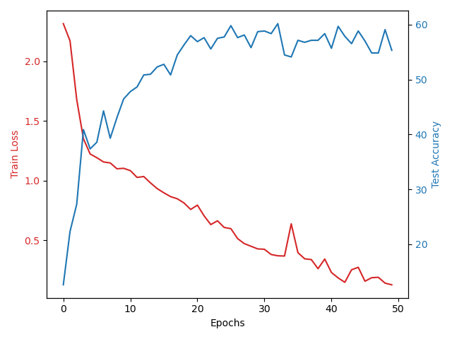

# 2023HIT_TOC_Image_Identification
2023HIT计算理论课设，完成不同方法完成图像的识别，并比较图像识别的效果。

## 数据集准备
使用数据集：https://www.kaggle.com/datasets/julichitai/multilabel-small-car-and-color-dataset 数据集中图片以裁切好。数据集中的文件结构如下：
``` 
.
├── matiz black
├── matiz blue
├── matiz red
├── rio black
├── rio blue
├── rio red
├── tiggo black
├── tiggo blue
└── tiggo red
``` 
数据集一共有9个类，使用不同的模型对以上图片进行分类，并对分类结果进行分析。

## 传统方法进行识别
在深度学习出现之前，有很多传统方法完成图像的识别，这些方法有着不错的准确度。使用一些传统方法进行识别，并分析其中识别的原理，比较不同模型的差别。

> 有很多识别图像的传统方法，负责这部分的同学可以在支持向量机、层次聚类、马尔可夫随机场、随机森林、AdaBoost等方法内选择两个方法进行撰写(当然如果有更好的也可以)。模型写完后分析一下模型的优缺点和识别失败的图像的原因。将分析的内容写在readme文件中，画的图和相关的代码直接在仓库中建一个文件夹push上去即可。

##Adaboost（传统方法）
AdaBoost是Adaptive+Boosting的组合词。

算法的定义如下：
弱分类器（weak classifier）通过顺序（sequential）学习相互补充，并将它们组合在一起以最终提高强分类器（strong classifier）的性能。

工作原理如下：
弱分类器（weak classifier）一次一个地顺序进行学习。首先学习的分类器会产生正确分类的数据和错误分类的数据。首先学习的分类器将正确分类的结果信息和错误分类的结果信息传递给下一分类器。下一分类器利用从前一个分类器接收到的信息来提高分类不佳的数据的权重（weight）。也就是说,通过不断调整前一个分类器错误分类样本的权重，使其更集中于错误分类的数据，从而使学习效果更好。因此，名称中带有“adaptive”。最终分类器（strong classifier）通过对先前学习的弱分类器分别应用权重并进行组合来进行学习。

总结一下，就是将预测性能较低的弱分类器组合在一起，最终形成一个性能稍好一些的强分类器。弱分类器通过相互补充（adaptive）的方式进行学习，并通过组合这些弱分类器来形成一个分类器，因此称为 boosting。

用公式表示如下：

H(x)：最终强分类器，也称为加权多数投票分类器。
h：弱分类器，也称为基分类器。
α：弱分类器的权重，用于衡量弱分类器对最终分类器的重要性。
t：迭代次数，表示弱分类器的数量。
具体来说：
H(x) 表示最终强分类器对输入样本 x 的预测结果。
h 表示第 t 个弱分类器对输入样本 x 的预测结果。
α 表示第 t 个弱分类器的权重。
t 表示 AdaBoost 算法迭代的次数，即训练的弱分类器的数量。

具体来说，AdaBoost 算法的工作原理如下：
1.初始化训练数据集的每个样本的权重为 1/N，其中 N 是训练数据集的样本数。
2.训练一个弱分类器。
3.计算弱分类器的错误分类率。
4.将错误分类率高的样本的权重增加，将错误分类率低的样本的权重减少。
5.重复步骤 2-4，直到满足某个终止条件。
6.将所有弱分类器的输出通过加权求和得到最终的强分类器的输出。

AdaBoost 算法是提升算法（boosting algorithm）的一种，具有以下优点：
-可以有效地提高弱分类器的性能。
-可以处理异常值。
-可以处理不平衡数据集。
AdaBoost 算法在分类、回归、异常检测等领域都有广泛应用。


## 使用深度学习方法进行识别
在AlexNet出现后，深度学习成为识别图像的一种主要方法。近年来有很多识别图像的深度学习模型。使用多种不同规模、不同原理的模型，对图像进行识别。分析模型的原理，并比较不同模型的准确度差别，以及神经网络模型的优势。

> 大家对完成的模型的效果进行量化分析，并画一些简单的图进行分析。最好提取出识别失败的图像，分析一下失败的原因。分析的内容大家写到readme文件中，画的图和相关模型的代码直接push到相关的文件夹内即可。

### AlexNet模型
AlexNet 是一个深度卷积神经网络，它的结构如下：
1. 输入层：
- 输入图像的尺寸为 227x227x3
2. 第一层（C1）：
- 卷积层：使用 96 个 11x11 的卷积核，步长为 4，用 2 填充。
- 激活函数：ReLU
- 局部相应归一化（LRN）
- 最大池化：使用 3x3 的核，步长为 2
3. 第二层（C2）：
- 卷积层：使用 256 个 5x5 的卷积核，步长为 1，用 2 填充。
- 激活函数：ReLU
- 局部相应归一化（LRN）
- 最大池化：使用 3x3 的核，步长为 2
4. 第三层（C3）：
- 卷积层：使用 384 个 3x3 的卷积核，步长为 1，用 1 填充。
- 激活函数：ReLU
5. 第四层（C4）：
- 卷积层：使用 384 个 3x3 的卷积核，步长为 1，用 1 填充。
- 激活函数：ReLU
6. 第五层（C5）：
- 卷积层：使用 256 个 3x3 的卷积核，步长为 1，用 1 填充。
- 激活函数：ReLU
- 最大池化：使用 3x3 的核，步长为 2
7. 第六层（F6）：
- 全连接层：有 4096 个神经元
- 激活函数：ReLU
- Dropout：为了减少过拟合，训练时随机丢弃一半的神经元
8. 第七层（F7）：
- 全连接层：有 4096 个神经元
- 激活函数：ReLU
- Dropout：为了减少过拟合，训练时随机丢弃一半的神经元
9. 输出层（F8）：
- 全连接层：有 9 个神经元，对应于数据集的 9 个类别
- 激活函数：Softmax，用于分类概率输出

AlexNet 主要特点：
1. 更深的网络结构：AlexNet由 5 个卷积层、3 个全连接层和最后的 Softmax 分类层组成。
2. ReLU 激活函数：AlexNet 是第一个大规模使用 ReLU 作为激活函数的网络，这加速了训练过程。
3. Dropout：为了减少过拟合，AlexNet 在全连接层中使用了 Dropout。
4. 局部响应归一化（LRN）：在某些卷积层后使用了局部响应归一化。
5. 数据增强：为了进一步减少过拟合，AlexNet 使用了图像平移、翻转和颜色变化等数据增强技术。

训练结果如下：

在训练过程中，我们将数据集按 7：3 的比例划分为训练集和测试集。采用 AlexNet 进行训练，训练 50 轮后，发现模型对于测试集的预测准确率不断上升，最后趋于稳定，稳定在 55% 左右；损失函数值也在不断下降，最终达到了 0.13。考虑到样本集中的数据量只有 2700 左右，数据量偏少，因此训练效果不是很理想。如果增大样本集规模，模型预测的准确率应该会有进一步提升。
在训练过程中发现，虽然损失函数值在下降，但是预测准确率却并未上升，有时甚至下降，这说明模型可能存在过拟合现象，这也可能是导致模型预测准确率不高的原因之一。

### YOLO模型

### Vision Transformer(ViT)模型
